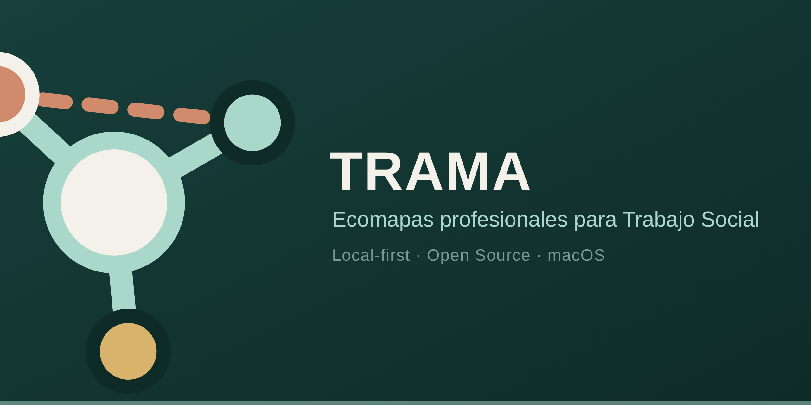
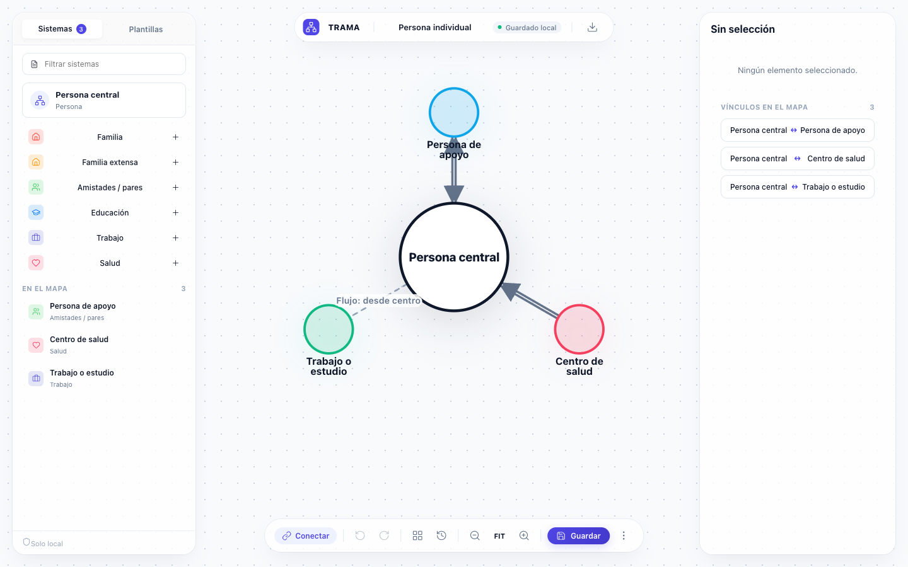
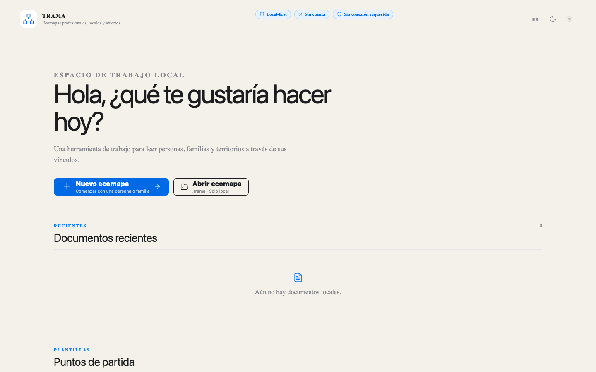
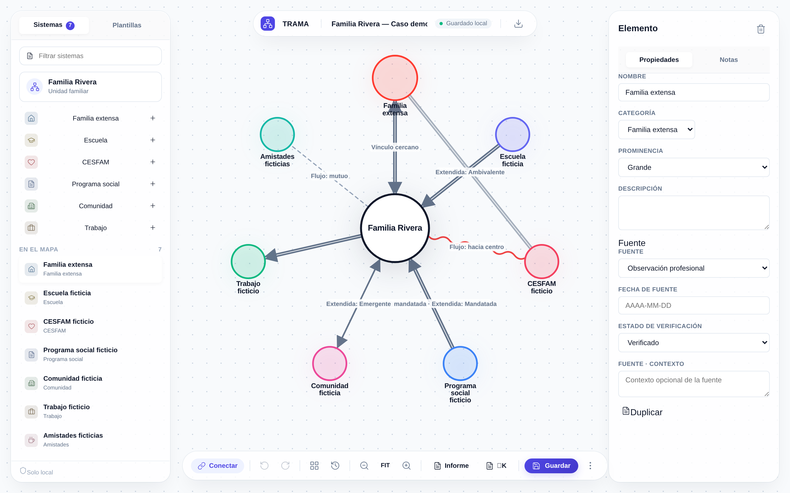
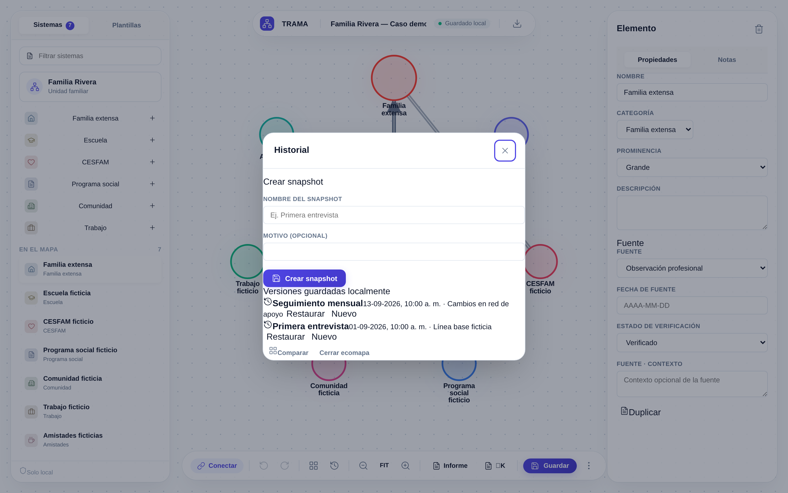
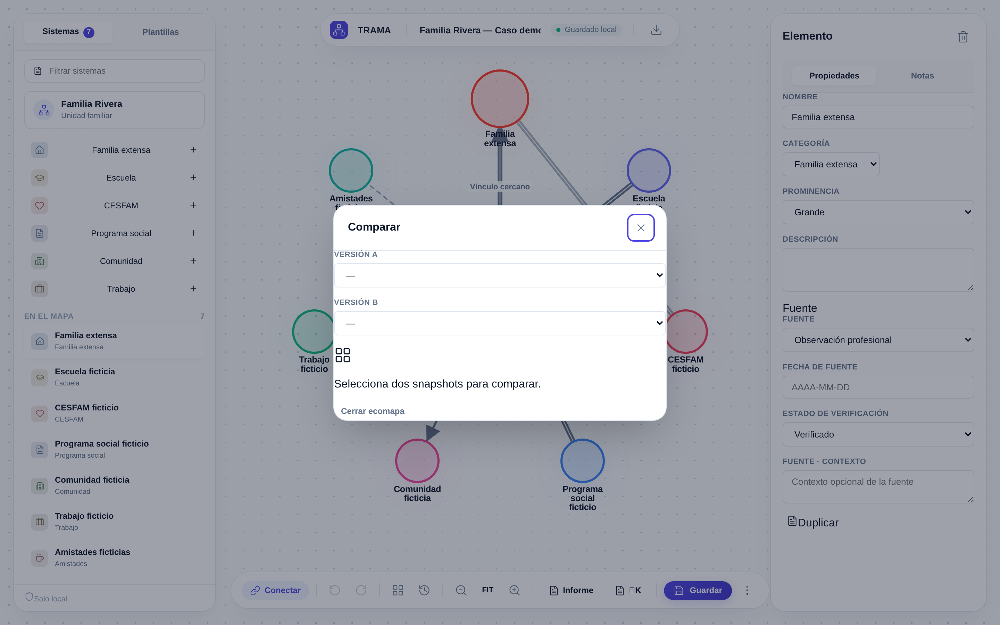
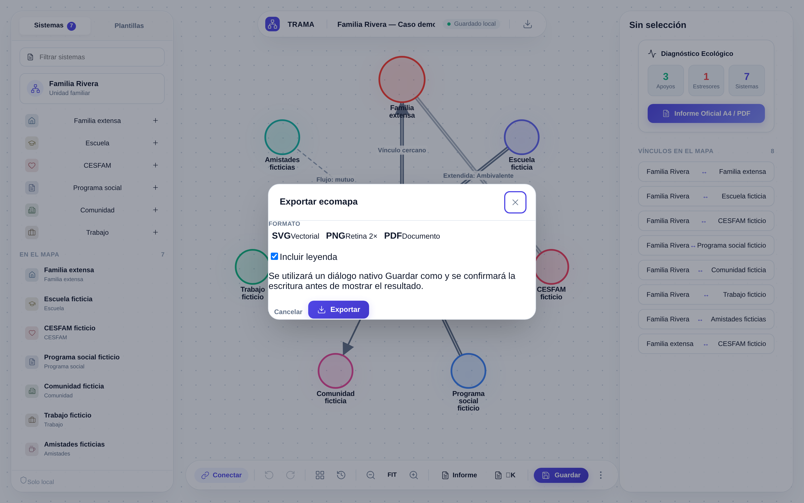
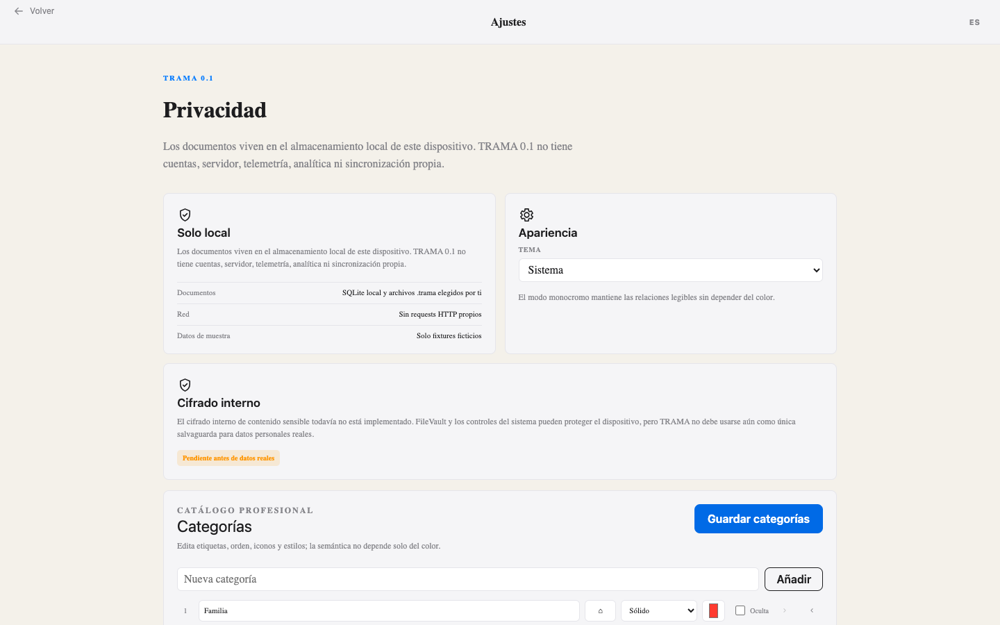

<div align="center">
  
</div>

<h1 align="center">TRAMA</h1>

<p align="center">
  <strong>Open-source, local-first ecomap desktop app for social work and community practice.</strong>
</p>

<p align="center">
  <a href="https://github.com/AtelierMinuit/TRAMA/actions/workflows/frontend-quality.yml"></a>
  <a href="https://github.com/AtelierMinuit/TRAMA/actions/workflows/rust-quality.yml"></a>
  <a href="https://github.com/AtelierMinuit/TRAMA/actions/workflows/release.yml"></a>
  <a href="https://github.com/AtelierMinuit/TRAMA/actions/workflows/codeql.yml"></a>
  <a href="https://www.gnu.org/licenses/agpl-3.0"></a>
  
</p>

<p align="center">
  <a href="#installación">Install</a> ·
  <a href="#desarrollo">Develop</a> ·
  <a href="https://atelierminuit.github.io/TRAMA/">Website</a> ·
  <a href="README.es.md">Español</a>
</p>

---

TRAMA is a desktop application for creating, editing, and analyzing **ecomaps** — the relational diagrams used in social work, family therapy, and community practice to map the network of systems around a person or family. It is designed for professionals who need a standardized, reproducible tool that respects the confidentiality of case data.

> **Status: alpha.** TRAMA is functional but pre-1.0. The ecomap editor, snapshots, temporal comparison, and SVG/PNG/PDF export work today. See [Known limitations](#limitaciones-actuales) and [ROADMAP.md](ROADMAP.md).

<div align="center">
  
  <br>
  <em>Editor with the fictitious "Familia Rivera" demo case</em>
</div>

---

## Why TRAMA

Generic diagramming tools do not understand the semantics of human relationships. TRAMA provides a structured, academically-grounded approach to ecomapping:

- **Semantic relationships.** Standard and extended relationship types (strong, stressful, conflictual, enmeshed, cutoff, mandated, …) each rendered with a distinct line style — not only color — so the map stays readable in grayscale and for color-blind users.
- **Energy flow.** Every relationship can carry an independent energy-flow direction (toward center, away, mutual), a dimension missing from most generic tools.
- **Snapshots & comparison.** Capture a named, dated snapshot of a case at any point and compare two snapshots to see exactly what changed between sessions.
- **Provenance.** Every node and connection can record its source type (client report, professional observation, working hypothesis, …) and verification status — supporting defensible, evidence-based practice.
- **Portable cases.** Export and import `.trama` files (an open ZIP container) to continue work on another device, with no cloud or account required.

## Privacy — honestly

TRAMA is **local-first**: all case data is stored on your device. There is no server, no account, no telemetry, and no network calls in the application code.

- In the Tauri desktop build, data is stored in a **local SQLite database** on disk.
- In a browser, data falls back to `localStorage`.
- The `.trama` portable format is an unencrypted ZIP container. **TRAMA does not encrypt data at rest by itself.** Physical-at-rest protection depends on your device-level encryption (e.g. macOS FileVault). TRAMA is **not** end-to-end encrypted, because there is no network to encrypt against.
- File reads and writes are restricted by Tauri capabilities to paths chosen through native dialogs, with absolute-path and traversal validation, extension allowlists, and a 50 MiB size cap.

See [PRIVACY.md](PRIVACY.md) for the full, verifiable statement.

## Install

Pre-built binaries are published on the [Releases](https://github.com/AtelierMinuit/TRAMA/releases) page for macOS Apple Silicon.

> The macOS builds are **ad-hoc signed** (not notarized by an Apple Developer certificate). On first launch you may need to right-click → *Open* to bypass Gatekeeper, or remove the quarantine attribute manually. TRAMA does not disable Gatekeeper or SIP and does not request elevated privileges.

## Desarrollo

### Requisitos

- [Node.js](https://nodejs.org/) 22 LTS (see `.nvmrc`)
- [pnpm](https://pnpm.io/) 10
- [Rust](https://www.rust-lang.org/) stable (for the Tauri desktop build)
- macOS build also needs Xcode Command Line Tools

### Puesta en marcha

```bash
git clone https://github.com/AtelierMinuit/TRAMA.git
cd TRAMA
pnpm install
```

### Comandos

| Comando | Descripción |
| --- | --- |
| `pnpm dev` | Vite dev server (http://localhost:1420) |
| `pnpm typecheck` | TypeScript sin emisión |
| `pnpm lint` | ESLint |
| `pnpm test` | Vitest (pruebas unitarias) |
| `pnpm build` | Build frontend → `dist/` |
| `pnpm tauri dev` | App Tauri en desarrollo |
| `pnpm tauri build` | Bundle macOS `.app` / `.dmg` |
| `pnpm license:audit` | Auditoría de licencias de dependencias |
| `pnpm check` | Agregador: typecheck + lint + test + build |

## Capturas

<div align="center">
<table>
  <tr><td align="center"><br>Dashboard</td>
  <td align="center"><br>Editor</td></tr>
  <tr><td align="center"><br>Inspector de relación</td>
  <td align="center"><br>Snapshots / versiones</td></tr>
  <tr><td align="center"><br>Comparación temporal</td>
  <td align="center"><br>Exportación</td></tr>
  <tr><td align="center"><br>Ajustes / privacidad</td>
  <td align="center"><br>Modo oscuro</td></tr>
</table>
</div>

All screenshots use **only fictitious data** (the "Familia Rivera" demo case).

## Architecture

TRAMA follows a layered structure separating domain logic from infrastructure and presentation:

- **Domain** (`src/domain`): the ecomap model, relationship/flow types, snapshot comparison, defaults. No UI, no I/O.
- **Infrastructure** (`src/infrastructure`): SQLite + localStorage repository, the portable `.trama` format, SVG/PNG/PDF export, platform (Tauri) bridge.
- **Adapters** (`src/adapters`): SchemaTex DSL projection — the canonical, reproducible rendering source.
- **Presentation** (`src/screens`, `src/components`, `src/modals`): React UI; state orchestrated through `DocumentContext`.
- **Native** (`src-tauri`): Rust shell — native menus, validated file read/write, SQLite migrations.

See [ARCHITECTURE.md](ARCHITECTURE.md) and [DATA_MODEL.md](DATA_MODEL.md).

## Formats

- **`.trama`** — open ZIP container with `manifest.json`, `ecomap.json`, and `snapshots/*.json`. Versioned, validated on import (path-traversal and ZIP-bomb protection, structural and type checks).
- **SVG** — vector export with optional legend, theme-aware.
- **PNG** — raster export at 2× scale.
- **PDF** — vector PDF via `svg2pdf`, A4-oriented.

## Roadmap

See [ROADMAP.md](ROADMAP.md). In short:

- **0.1.x** — stability, UX, accessibility, export, formats.
- **0.2** — mini-genogram center, advanced comparison, new layouts.
- **0.3** — full genogram.
- **Future** — optional local AI, assisted analysis, transcription, integrations.

## Contributing

Contributions are welcome. Please read [CONTRIBUTING.md](CONTRIBUTING.md). Pull requests should pass `pnpm check` and, when changing UI, include screenshots using only fictitious data.

## Security

Report vulnerabilities privately — see [SECURITY.md](SECURITY.md). **Do not** attach real case files, personal data, or anything identifying a real child or family to a public issue.

## License

TRAMA is licensed under **GNU AGPL-3.0-only**. The SchemaTex rendering engine is also AGPL-3.0-only. See [LICENSE](LICENSE) and [THIRD_PARTY_NOTICES.md](THIRD_PARTY_NOTICES.md) for dependency licenses.

## Limitaciones actuales

- macOS Apple Silicon only for pre-built binaries (no Windows/Linux build published).
- Builds are ad-hoc signed, not notarized.
- No data-at-rest encryption beyond the OS (FileVault); the SQLite database is not encrypted.
- No multi-user / cloud sync (by design).
- Genogram support is not yet implemented (planned for 0.2–0.3).
