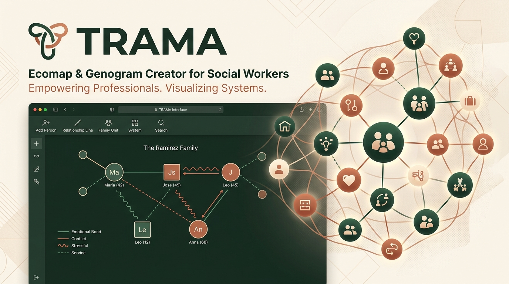
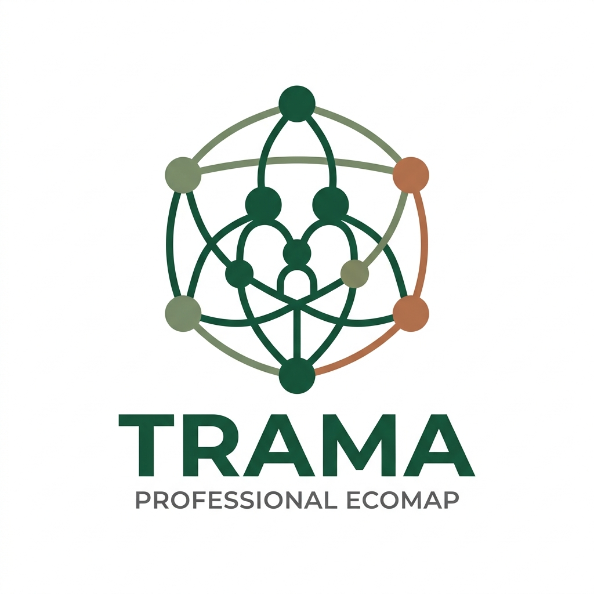

<div align="center">
  
</div>

<h1 align="center">TRAMA</h1>

<p align="center">
  <strong>El estándar profesional para la creación y análisis de ecomapas y genogramas en Trabajo Social.</strong>
</p>

<p align="center">
  <a href="https://github.com/AtelierMinuit/TRAMA/actions"></a>
  <a href="https://www.gnu.org/licenses/agpl-3.0"></a>
  <a href="https://reactjs.org/"></a>
  <a href="https://www.typescriptlang.org/"></a>
</p>

<br />

TRAMA es una aplicación web y de escritorio diseñada *por* y *para* profesionales del área social, psicología y salud familiar. Resuelve la histórica necesidad de contar con una herramienta digital ágil, estandarizada y segura para el mapeo de redes vinculares, superando las limitaciones del dibujo manual o herramientas genéricas de diagramación.

Diseñada bajo el paradigma **Local-First**, TRAMA garantiza confidencialidad absoluta: los datos sensibles de los casos y familias nunca abandonan tu dispositivo, asegurando el cumplimiento de las normativas de privacidad más estrictas (como HIPAA y RGPD).

---

## 🎯 Por qué TRAMA

Las herramientas tradicionales de diagramación no entienden la complejidad de los vínculos humanos. TRAMA introduce un enfoque semántico para el Trabajo Social:

- 🛡️ **Privacidad Absoluta (Local-First):** Todo el procesamiento y almacenamiento ocurre en tu navegador. No hay servidores intermediarios. No hay bases de datos en la nube accediendo a historias clínicas.
- 🧩 **Simbología Estandarizada:** Trazos y conexiones basados en literatura académica formal. Distinción visual instantánea entre vínculos conflictivos, estrechos, distantes o cortados.
- 🚀 **Flujo de Trabajo Especializado:** Plantillas listas para usar (Familias, Adolescentes, Adultos Mayores) y atajos de teclado pensados para mapear una entrevista en tiempo real.
- 📤 **Exportación Profesional:** Generación de gráficos vectoriales o imágenes en alta resolución con leyenda incorporada, listos para adjuntar en informes periciales, carpetas sociales o historias clínicas.
- 💾 **Portabilidad de Casos:** Exporta e importa archivos `.trama` de manera segura para continuar tu trabajo en otro equipo.

---

## 📸 Interfaz y Herramientas

<div align="center">
  
</div>

TRAMA ofrece un lienzo infinito (Infinite Canvas) de alto rendimiento capaz de sostener mapas de red extensos sin degradación visual. Su diseño de interfaz prioriza el contenido, con paletas de colores cálidas y contraste accesible (WCAG) para reducir la fatiga visual en jornadas de análisis extendidas.

---

## 🚀 Instalación y Despliegue Local

TRAMA está construido sobre un stack tecnológico moderno, robusto y mantenible (**React 18, TypeScript, Vite**), siguiendo principios de *Clean Architecture*.

### Requisitos Previos

- [Node.js](https://nodejs.org/) (v18+)
- [pnpm](https://pnpm.io/) (v8+)

### Iniciar el entorno de desarrollo

1. **Clonar el repositorio**
   ```bash
   git clone https://github.com/AtelierMinuit/TRAMA.git
   cd TRAMA
   ```

2. **Instalar dependencias**
   ```bash
   pnpm install
   ```

3. **Ejecutar el servidor local**
   ```bash
   pnpm run dev
   ```

4. Abre `http://localhost:5173` en tu navegador de preferencia.

### Compilación para Producción

Para generar los archivos estáticos listos para despliegue:

```bash
pnpm run build
```
Los artefactos compilados y optimizados se generarán en el directorio `dist/`.

---

## 🛠 Arquitectura (Clean Code)

TRAMA está diseñado para ser altamente escalable. Su arquitectura separa estrictamente el Dominio, la Infraestructura y la Capa de Presentación:

- **Core State:** Orquestado globalmente mediante React Context (`DocumentContext`), eliminando el antipatrón de *Prop Drilling*.
- **Historial No Destructivo:** Implementación de un modelo transaccional inmutable para proveer *Deshacer/Rehacer* (Undo/Redo) seguro mediante el hook `useEcomapHistory`.
- **Renderizado Gráfico:** Motor de lienzo optimizado que delega operaciones pesadas fuera del ciclo principal de React para mantener los 60FPS.

---

## 🤝 Contribución

¡TRAMA es un proyecto impulsado por la comunidad! Creemos que el software para fines sociales debe ser de código abierto y colaborativo.

Si deseas contribuir, por favor revisa nuestro documento de [CONTRIBUTING.md](CONTRIBUTING.md). Valoramos:
1. Reportes de Bugs detallados.
2. Sugerencias de nuevas tipologías de redes y relaciones.
3. Pull Requests que sigan nuestros lineamientos de linteo (ESLint) y TypeScript estricto.

---

## 📄 Licencia

TRAMA se distribuye bajo la licencia **GNU Affero General Public License v3.0 (AGPL-3.0)**. 
Garantizamos que este software y cualquier modificación del mismo permanezca siempre libre, abierto y disponible para la comunidad. 

Consulta el archivo [LICENSE](LICENSE) para más detalles.

---
<div align="center">
  <sub>Construido con dedicación para empoderar a los profesionales de ayuda.</sub>
</div>
